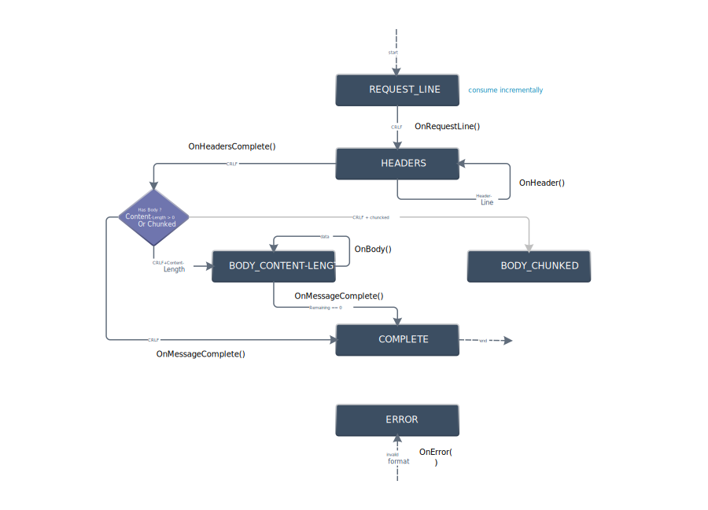

# Server Demo

这是一个从零开始构建的 C++ 服务器学习项目。

本项目旨在从一个最基本的迭代服务器出发，逐步完善至现代的高性能服务器模型。通过这一过程，探究现代服务器架构中各种技术（如 Reactor、Epoll、线程池等）是为了解决什么具体问题，并定量分析这些技术带来的性能提升。

## 项目背景

此项目起源于我之前学习实现的一个 HTTP Server。在过程中我虽然使用了 Reactor、Epoll 等技术，但对为什么要这么做以及性能提升究竟有多大缺乏直观的量化认知。因此，我希望以总结历史的视角，通过代码迭代来回答这些问题。

## 项目架构
项目目前主要分为两部分：应用层和IO层
### 1. 应用层
负责HTTP协议解析和请求路由，以及具体的业务逻辑的处理
- **HTTP Parser**：基于有限状态机（Finite State Machine）模型实现，高效解析HTTP请求报文。

- **HTTP Router**: 基于Radix-Tree实现URL路由分发，把不同的HTTP请求分发给对应的Handler。
- **Handler**: 具体的业务处理函数的虚基类，

### 2. IO层
负责数据传输的IO处理和连接管理

## 当前功能特性
- [x] **基础的 HTTP 通信支持**：解析 HTTP GET 请求，返回静态资源。
- [x] **HTTP Parser**：基于有限状态机模型的HTTP请求解析器
- [x] **路由系统**：支持根据 URL 路径分发请求。
- [x] **性能测试**：包含 QPS 计算与并发测试脚本(完善中)。

## 快速开始

### 环境要求
- Linux 环境
- G++ (支持 C++11 及以上)
- Make

### 安装与运行

```sh
# 1. 克隆仓库
git clone https://github.com/chengxug/Server_demo.git
cd Server_demo

# 2. 编译
make

# 3. 运行服务器 (默认端口 7788)
cd build
./server 7788
```

启动后，你会看到如下输出：
```text
Server started on port 7788
Press Enter to stop the server..
```

此时在浏览器访问 `http://localhost:7788`，即可看到 `index.html` 的内容。

## TODO List (优先级从高到低)

- [x] 引入spdlog, 添加日志打印
- [x] 添加Makefile
- [x] 功能完善：不直接关闭连接，而是等客户端主动关闭或错误发生。
- [x] 添加对http协议的解析
- [x] 实现router，将http请求路由到对应的处理程序
- [x] 编写测试程序计算qps
- [x] 优化测试程序：使用条件变量控制所有工作线程准备好后一起开始
- [x] 对socket封装，依据RAII设计思想
- [ ] 监听线程使用非阻塞的accept 替换 select
- [x] 添加信号处理 Ctrl C
- [x] 编写测试脚本tests/test.sh，在Makefile中调用以执行所有测试
- [x] Makefile 支持 debug 和 release
- [x] 参考[proxygen](https://github.com/facebook/proxygen)优化解析器和路由的设计
- [x] 接入优化后的解析器和路由到项目中
- [ ] 打印 std::function 包装的函数的名称，以调试使用
- [ ] 测试在不同并发量，不同负载下的性能表现

## Third-Party Code

本项目使用了以下开源仓库的代码，感谢原作者的贡献：

- [spdlog](https://github.com/gabime/spdlog)  
  A fast C++ logging library.  
  License: MIT

- [ThreadPool](https://github.com/progschj/ThreadPool)  
  A simple C++11 thread pool implementation.  
  License: Zlib
